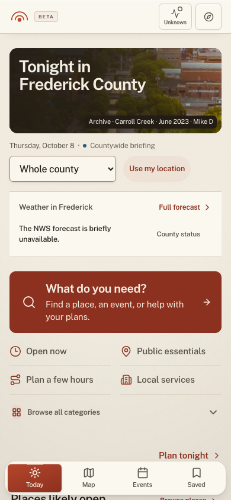
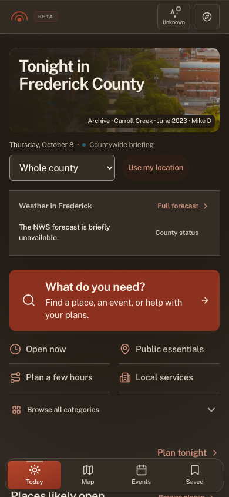

# Weather-first Today review

Weather now precedes Find, place choices, events, and seasonal context. On phones it follows the archive masthead and explicit scope. At desktop widths of 960px or more, it shares the first row with the masthead. Active civic alerts retain priority.

The reading keeps the existing NWS, alert, and air-quality adapters and their parallel deadlines. Its temperature, condition, high, sun event, source, and actual NWS issuance appear together. Missing issue times and unavailable feeds are explicit. The archive photograph is labelled as archival material.

Find uses quieter utility rows. Event details use neutral facts and theme-aware links. A single closed Saved event no longer reserves an empty 186px card; multi-item and expanded decks retain their geometry. Map recovery heading, count, and rows share the 16px gutter.

## Validation

- Full Vitest suite: 8,452 passed and two existing skips.
- Full component workshop: 140 passed.
- Typecheck, changed-file ESLint, copy, color, and layering guards passed.
- Production build passed using the committed data snapshot and a provider-egress guard.
- All 51 required UI audit cases and 15 Today layout/priority browser cases passed without retry. The weather cases cover 320, 375, 390, and 430px phones and desktop in light and dark themes. They check ordering, fold visibility, overflow, one forecast anchor, target geometry, and keyboard route requests.
- Ten Find, Ask, Compass, and bus-sheet visual captures passed at 375px and 1366px. All ten captures received a read-only visual review with no visible layout, readability, disclosure, focus, or brand regression found. Some are element crops rather than entire viewports. Ask working is a held-request fixture and the bus sheet shows honest map-error recovery. These macOS captures are review evidence, not approved Linux pixel baselines.

The first combined 78-case browser run produced 71 passes, one failure, and six serial cases not run. The failure was the live Map chooser: no map-service credentials are present in the isolated build, which correctly renders its recovery state. The ten other visual cases were subsequently captured in a separate bounded run. No test assertion was removed or live-map state fabricated to hide this limitation.

The provider-egress guard intentionally produces the unavailable weather state in these two unaltered screenshots. Healthy, partial, delayed, missing-issuance, warning, and air-quality states are covered by mocked adapter tests and the actual presentation component workshop. Browser keyboard verification records the forecast route request and stops before entering Pulse's providers. Five-point target probes are bounded samples, not exhaustive area proof. Passing the existing axe gate does not establish complete site-wide accessibility certification.

## Mobile evidence

This review is local. It does not establish a live deployment, authenticated account behavior, or live-map readiness.
